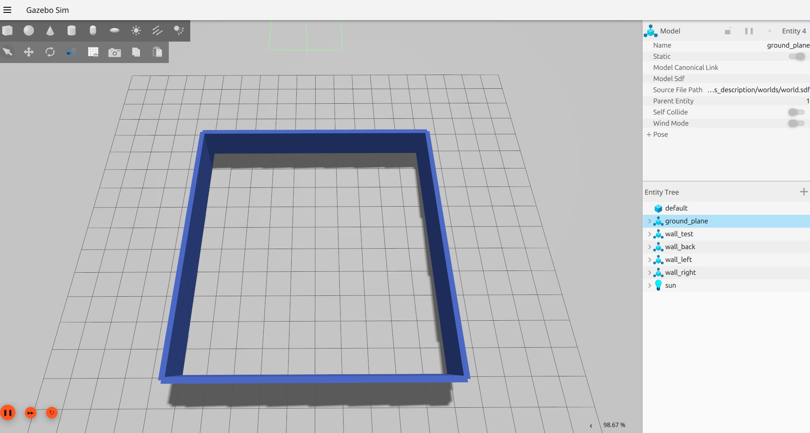
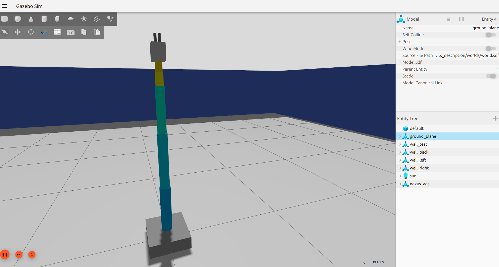
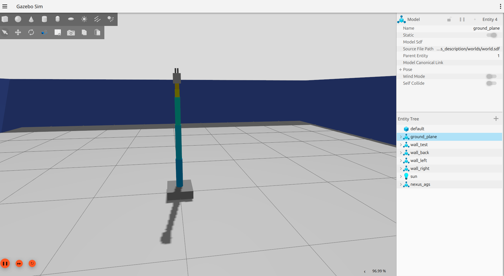
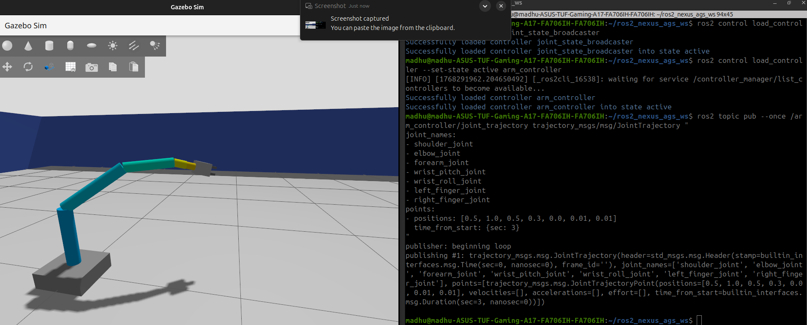
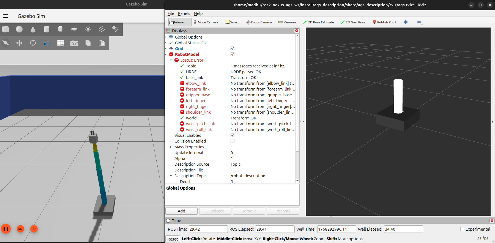
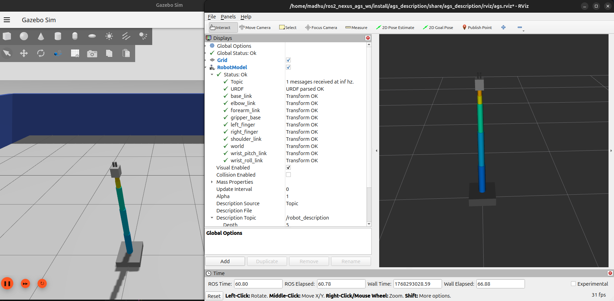
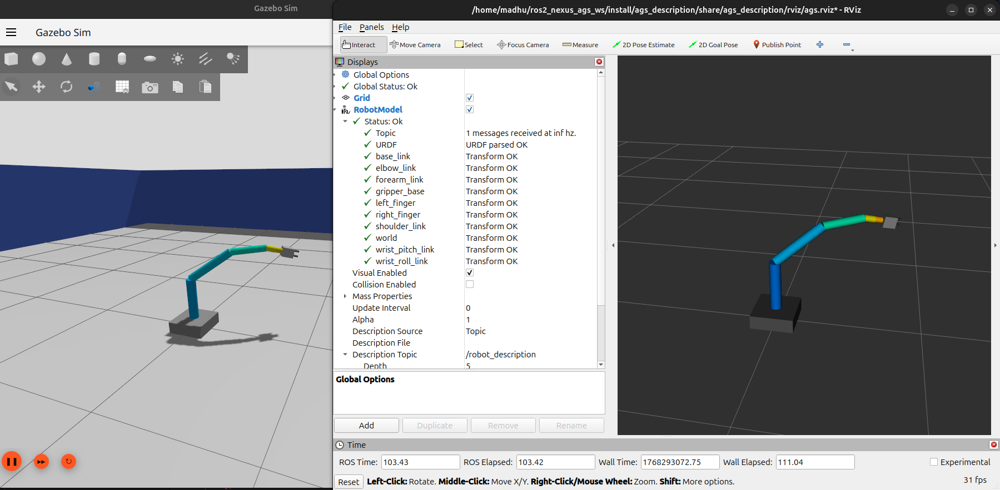
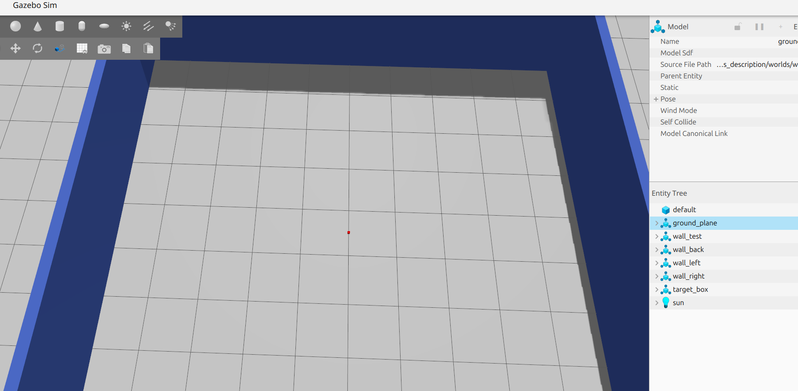
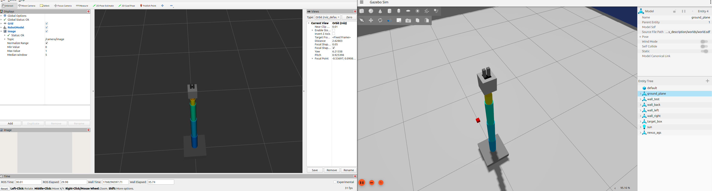
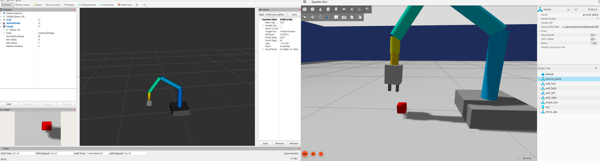

# ROS2_NEXUS_AGS

## Installation
- ROS2 JAZZY: https://docs.ros.org/en/jazzy/Installation/Ubuntu-Install-Debs.html
- GAZEBO HARMONIC: https://gazebosim.org/docs/harmonic/install_ubuntu
- ROS–Gazebo bridge: ``` sudo apt install ros-jazzy-ros-gz-sim ros-jazzy-ros-gz-bridge ros-jazzy-ros-gz ```
- OTHERS: ``` sudo apt install python3-colcon-common-extensions ros-jazzy-joint-state-publisher ros-jazzy-joint-state-publisher-gui ```
- CHECKING: ``` sudo apt install liburdfdom-tools ```

### Kill terminals: 
```
pkill -f ros2
pkill -f gazebo
pkill -f gz
pkill -f rqt
pkill -f rviz
pkill -f nav2
pkill -f slam_toolbox
```

### BUILD
```
cd ~/ros2_nexus_ags_ws
source /opt/ros/jazzy/setup.bash
colcon build --symlink-install
source install/setup.bash
clear
```


# GOAL 1: Render model in Gazebo

### STEP 1: Creating a workspace
```
mkdir -p ~/ros2_nexus_ags_ws/src
cd ~/ros2_nexus_ags_ws/src
source /opt/ros/jazzy/setup.bash
ros2 pkg create ags_description --build-type ament_cmake
```

### STEP 2: Creating folders structure
```
ags_description/
    ├── config/
        ├── 
    ├── launch/
        ├── gazebo_rviz.launch.py
    ├── urdf/
        ├── ags.xacro
    ├── worlds/
        ├── world.sdf
    ├── rviz/
        ├── ags.rviz
```
```
cd ~/ros2_nexus_ags_ws/src
mkdir -p ags_description/{config,launch,urdf,worlds,rviz}
touch ags_description/worlds/world.sdf
touch ags_description/launch/gazebo_rviz.launch.py
touch ags_description/rviz/ags.rviz
touch ags_description/urdf/ags.xacro
```

### STEP 3: Create world and render in gazebo
- Add folder config, launch, urdf, worlds, rviz, maps to CMakeLists.txt
- Add world, walls in world.sdf
- Add gazebo node in gazebo_rviz.launch.py
- Terminal 1: ros2 launch ags_description gazebo_rviz.launch.py
- 

### STEP 4: Create model and render in gazebo
- Add robot with these
```
world
└── world_joint → base_link
    ├── shoulder_joint → shoulder_link
    │   └── elbow_joint → elbow_link
    │       └── forearm_joint → forearm_link
    │           └── wrist_pitch_joint → wrist_pitch_link
    │               └── wrist_roll_joint → wrist_roll_link
    │                   └── gripper_mount_joint → gripper_base
    │                       ├── left_finger_joint → left_finger
    │                       └── right_finger_joint → right_finger
```
- Add spawn robot in gazebo_rviz.launch.py
- Terminal 1: ros2 launch ags_description gazebo_rviz.launch.py
- 

# GOAL 2: Move model in gazebo

### STEP 1: Move model via commands
- Add controllers.yaml
- Add **robot_state_publisher** node
- Add **/clock** bridge
- Add **ros2_control**, **GazeboSimROS2ControlPlugin** plugin to import controllers.yaml
- [BUILD](#build)
- Terminal 1: ros2 launch ags_description gazebo_rviz.launch.py
- Terminal 2: ros2 control load_controller --set-state active joint_state_broadcaster / ros2 control load_controller --set-state active arm_controller
- 
- Terminal 3:
```
ros2 topic pub --once /arm_controller/joint_trajectory trajectory_msgs/msg/JointTrajectory "
joint_names:
- shoulder_joint
- elbow_joint
- forearm_joint
- wrist_pitch_joint
- wrist_roll_joint
- left_finger_joint
- right_finger_joint
points:
- positions: [0.5, 1.0, 0.5, 0.3, 0.0, 0.01, 0.01]
  time_from_start: {sec: 3}
"
```
- 


### STEP 2: Move model via commands in gazebo and rviz
- Open rviz2 and save config as ags.rviz
- Add rviz node
- [BUILD](#build)
- Terminal 1: ros2 launch ags_description gazebo_rviz.launch.py
- 
- Terminal 2: ros2 control load_controller --set-state active joint_state_broadcaster / ros2 control load_controller --set-state active arm_controller
- 
- Terminal 3:
```
ros2 topic pub --once /arm_controller/joint_trajectory trajectory_msgs/msg/JointTrajectory "
joint_names:
- shoulder_joint
- elbow_joint
- forearm_joint
- wrist_pitch_joint
- wrist_roll_joint
- left_finger_joint
- right_finger_joint
points:
- positions: [0.5, 1.0, 0.5, 0.3, 0.0, 0.01, 0.01]
  time_from_start: {sec: 3}
"
```
- 

# GOAL 3: See the object via camera

### STEP 1: Add object
- Add a model in world.sdf
- gz sim -r ~/ros2_nexus_ags_ws/src/ags_description/worlds/world.sdf
- 

### STEP 2: Add camera and see the object
- Add camera link, joint and plugin **camera** in ags.xacro
- Add **/camera** bridge
- [BUILD](#build)
- Terminal 1: ros2 launch ags_description gazebo_rviz.launch.py
- Add Image and set topic as /camera/image
- Terminal 2: ros2 control load_controller --set-state active joint_state_broadcaster / ros2 control load_controller --set-state active arm_controller
- 
- Terminal 3:
```
ros2 topic pub --once /arm_controller/joint_trajectory trajectory_msgs/msg/JointTrajectory "
joint_names:
- shoulder_joint
- elbow_joint
- forearm_joint
- wrist_pitch_joint
- wrist_roll_joint
- left_finger_joint
- right_finger_joint
points:
- positions: [1.6, 1.0, 1.5, 0.55, 0.0, 0.01, 0.01]
  time_from_start: {sec: 3}
"
```
- 